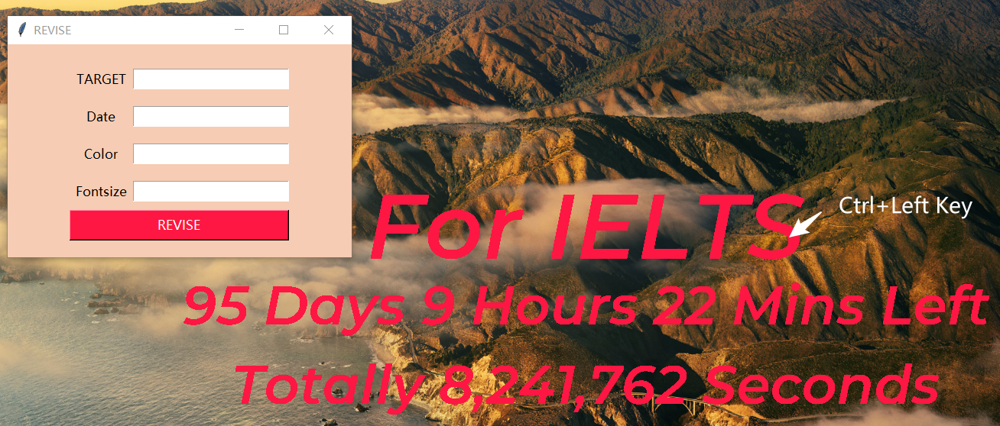
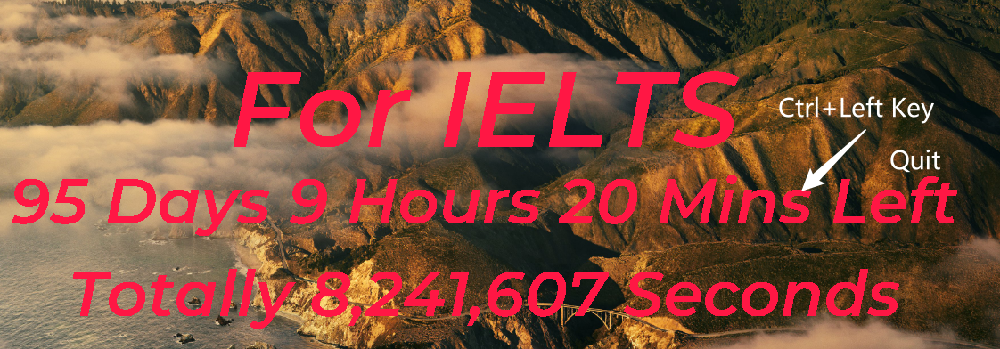
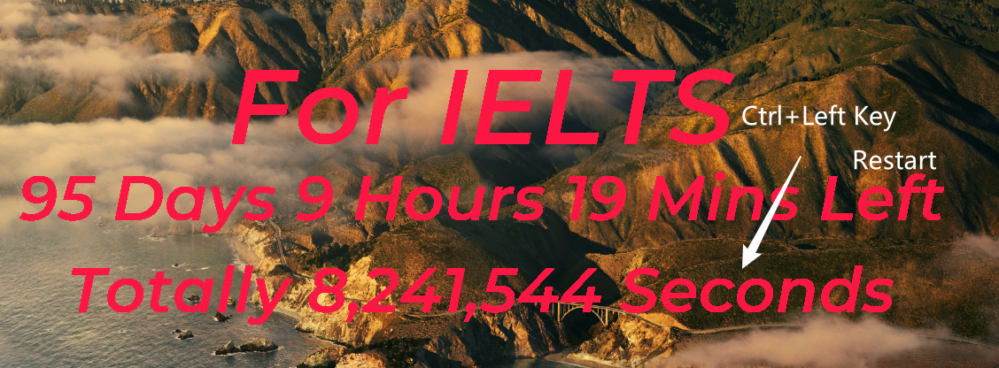

[中文版](./README.zh.md) | [English](./README.md)

---

# Screen Timer Software

This is a screen timer software for Windows, written in Python and designed with the tkinter library. It also supports setting up to run automatically at startup.

## Features
The software displays a **transparent background** timer on the screen that can be set for reminding yourself of mid- to long-term tasks like studying for the TOEFL or IELTS.

## Download and Use

1. Download the source repository and extract it to a folder.
2. Install Python version 3.7 or higher, then install all the dependencies according to the `requirements.txt` file by running `pip install -r requirements.txt`.
3. In the `selfstart.bat` file, update the paths to match the Python installation path and source code path on your system, e.g., `F:\\programer_files\\mini_conda` and `F:\\server\\screentimer\\src\\main.py`. Run the `selfstart.bat` to see the timer interface.
4. `Ctrl + Left Mouse Click` on the target display area (first row) to set goals for the timer as well as the date, font color, and size. The default font is `Montserrat SemiBold`, which you'll find in the `font` directory. You can download it or change the source code to use a different font to your liking.
   - `Target`: The goal (string), e.g., `"IELTS"`.
   - `Date`: The target date (string), e.g., `"2021-12-31"`.
   - `Color`: The font color (hexadecimal color code), e.g., `"#FF0000"` for red.
   - `Fontsize`: The font size (integer), default is 60.
   
5. `Ctrl + Left Mouse Click` on the timer display (second row) to exit the program.
   
6. `Ctrl + Left Mouse Click` on the timer display (third row) to restart the program.
   > Note: Due to a rendering issue with tkinter, you may see the original color's edges after changing the color. Restarting the program can fix this.

   

## Other Issues

- When using `win+D` or other methods to switch to the desktop, the timer might get hidden. You can switch back by pressing `Alt + Tab`, then click the minimize button to properly display the timer on the desktop. No solution for this issue yet.
- To set up the program to start automatically with your computer, place a shortcut of `selfstart.bat` in the `C:\Users\YourUsername\AppData\Roaming\Microsoft\Windows\Start Menu\Programs\Startup` folder.
- You can also directly set the resolution, adjust font size and color, as well as the target and target date in the `config` file then run the `timer.py` file.

## References
 
- [Logic for Timer Blog Reference](https://blog.csdn.net/qq_43495412/article/details/113099677)
- [Resolution Improvement Blog Reference](https://blog.csdn.net/qq_25921925/article/details/103987572)

## Support

If you find this project helpful, please give us a star!