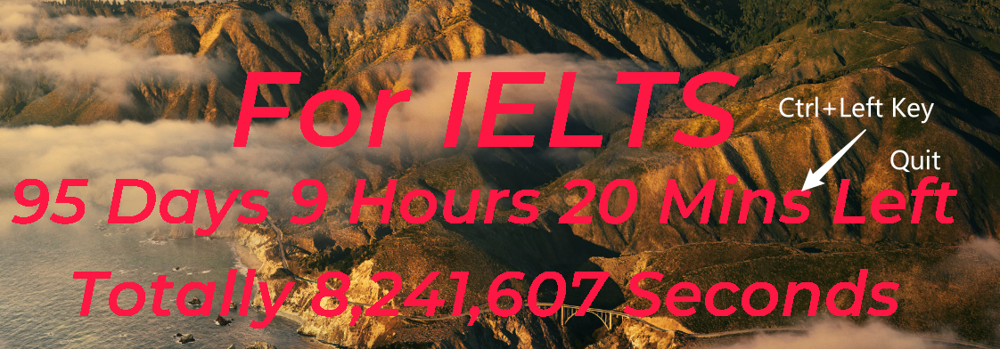
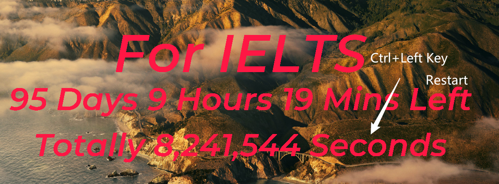

[中文版](./README.zh.md) | [English](./README.md)

---

# 屏幕计时器软件

***Hintonein 2024***

Windows下的屏幕计时器软件，使用Python编写，使用tkinter库进行界面设计,手动设置开机自启动。

## 功能

屏幕上显示一个**背景透明**计时器，可以设置计时器的时间，用于提醒自己的中长期任务，比如 TOEFL 和 IELTS。

## 下载和使用

1. 下载源仓库到本机，解压到一个文件夹。
2. 安装Python3.7以上版本，根据 `requirements.txt` 安装依赖库，可以使用 `pip install -r requirements.txt` 安装。
3. 然后在`selfstart.bat`文件中修改自己的Python路径比如`F:\\programer_files\\mini_conda`以及下载的源码里的python路径，比如`F:\\server\\screentimer\\src\\main.py`。运行`selfstart.bat`文件，即可看到计时器界面。
4. `Crtl + 鼠标左键` 点击计时器目标界面（第一行）可以设定计时器的目标以及目标日期、字体颜色和大小，默认采用 `Montserrat SemiBold` 开源谷歌字体，字体文件在 `font` 中，可以自行下载，也可以更改源码为自己喜欢的字体。
   1. 目标 `Target` 是字符串，比如直接输入 `IELTS`
   2. 目标日期 `Date` 是字符串，比如直接输入 `2021-12-31`
   3. 字体颜色 `Color` 采用 `#` 开头的十六进制颜色，比如 `#FF0000` 代表红色
   4. 字体大小 `Fontsize`是整数，默认60

1. `Crtl + 鼠标左键` 点击计时器目标界面（第二行）可以退出程序
   
2. `Crtl + 鼠标左键` 点击计时器目标界面（第三行）可以重启程序
   > 注意：在点击第一行更改颜色后，文字边缘会出现原来颜色的边缘，这是因为tkinter的文字渲染问题，可以通过重启程序解决。

   

## 其它问题

1. 如果直接采用 `win+D` 或其他方式切到桌面，计时器会被隐藏，可以通过 `Alt + Tab` 切换一个页面后，点击缩小窗口按钮看到桌面上计时器正常显示，目前还没有解决这个问题。
2. 开机自启动方法：将 `selfstart.bat` 文件的快捷方式放到 `C:\Users\用户名\AppData\Roaming\Microsoft\Windows\Start Menu\Programs\Startup` 文件夹下，即可实现开机自启动。
3. 可以直接在config文件中设置分辨率、调整字体大小和颜色，以及目标和目标日期，然后运行`timer.py`文件即可。
   

## 参考
 
[计时逻辑参考博客](https://blog.csdn.net/qq_43495412/article/details/113099677)
[分辨率改善参考博客](https://blog.csdn.net/qq_25921925/article/details/103987572)

## 支持

如果对您有帮助，请给个star，谢谢！

